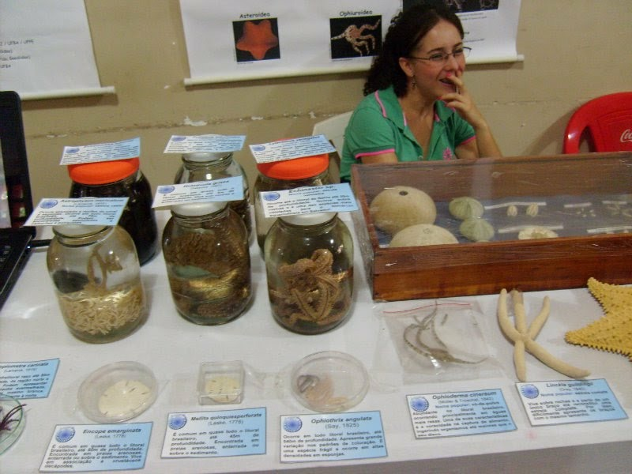
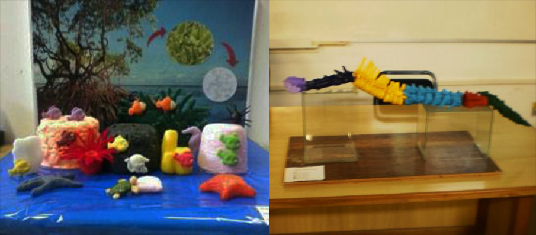
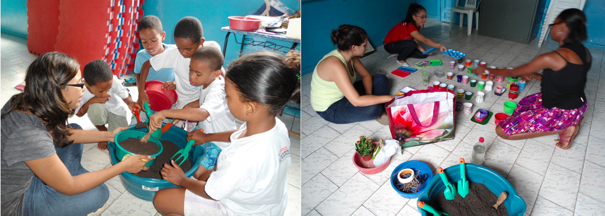

---
**Letters to a Pre-Scientist**
---

Inspire students’ curiosity about a future in STEM! The snail mail model was selected because it is low cost, accessible worldwide, and a unique way to facilitate human connection. Click at the [link](https://prescientist.org/) to know more about this amazing project.

---
**Museum exhibit**
---

Exhibition at the Museum of Zoology [UFBA](https://www.ufba.br) open to the public.

---
**Didactic models**
---

Development of didactic models for the explanation of contents for undergraduate students in the ecology and zoology classes: (1) how chemical substances produced by mangroves help to protect coral reefs; (2) the evolution of the vertebral column in mammals.

---
**Environmental Education**
---

Activity for students of the Integrated Center for Support to Children and Adolescents (CIAC), inserted in a community with socio-economic vulnerability in Salvador, Brazil. Five workshops were held whose central theme revolved around sustainable alternatives for reusing and recycling solid and organic waste. **Work team:** Amanda Alves, Diana Rezende, Rosana Cunha and Roseane Moreira.

---

